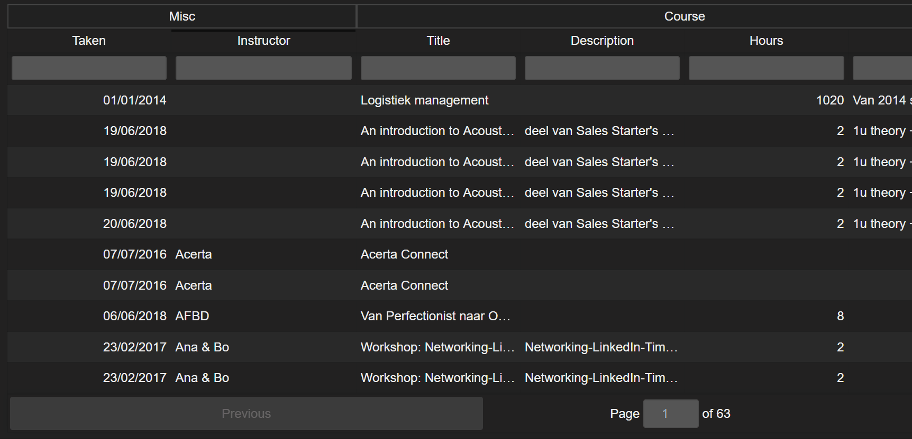
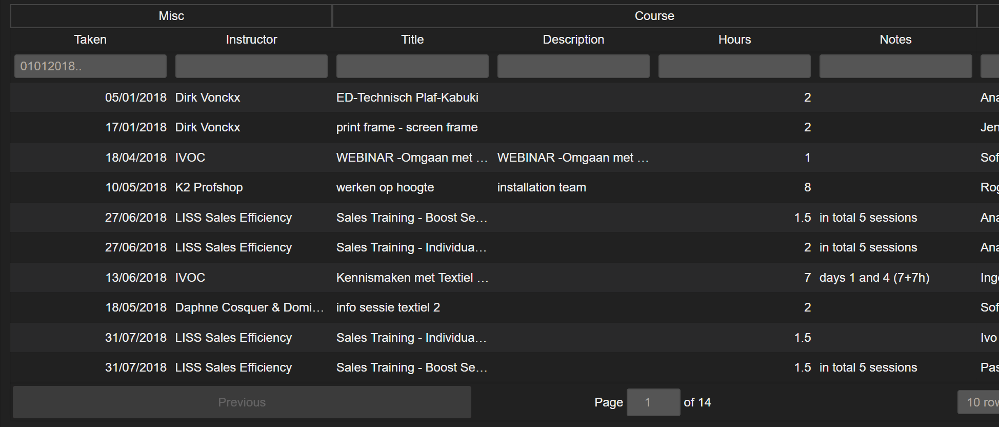
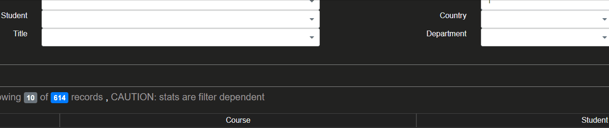

## Index

### Basic User Documentation
* [Filtering Tables](#filtering-tables)
* [Sorting Columns](#sorting-columns)
* [DropDownList Input](#dropdownlist-input)

### Specific Report Documentation
* [Training Logs](training_logs.md)

### Filtering Tables

* [Date Filtering](#date-filtering)
* [Number Filtering](#number-filtering)
* [String Filtering](#string-filtering)

**Table Filtering fields have a throttling field. Which means that your filter will only apply when you stop typing for a second.**

### Date Filtering

* `01012018..` find all dates from 01/01/2018 and onwards
* `..01012018` find all dates before and until 01/01/2018
* `01012018..05012018` find all dates from 01/01/2018 until 05/01/2018

[Back To Index](#index)

### Number Filtering

* `1..3` include all numbers between 1 and 3
* `>3` or `3..` find all numbers bigger than or equal to 3
* `<3` or `..3` find all numbers smaller than or equal to 3
* `0` will filter out empty or 0 values

[Back To Index](#index)

### String Filtering

string filtering is always case insensitive

* `ana` find all matches containing this combination of letters (case insensitive)
* `ana|bo|steve` look for all occurrences of 'bo' and 'ana' and 'steve' (case insensitive)
* `@Bo Bettens` look for this exact match (case SENSITIVE)
* `@Ana & Bo|Bo Bettens` look for all occurrences of these exact matches (case SENSITIVE)
* ` ` enter a space (' ') character to filter out all empty values

[Back To Index](#index)

### Sorting Columns

Click on any of the column headers to apply sorting by that column, clicking again will switch the sorting from ascending to descending.
Clicking on another column after that will undo the sorting by that column and enable sorting by another column.

[Back To Index](#index)

### DropDownList Input

DropDownList Input can be used to look for existing values for the input field as well as create new ones if said option has been enabled for that particular field.

* **<kbd>ALT + DOWN arrow<kbd>** open dropdown
* **<kbd>ALT + UP arrow<kbd>** close dropdown
* **<kbd>DOWN arrow<kbd>** move focus to next item
* **<kbd>UP arrow<kbd>** move focus to previous item
* **<kbd>HOME<kbd>** move focus to first item
* **<kbd>END<kbd>** move focus to last item
* **<kbd>ENTER<kbd>** select focused item
* **<kbd>CTRL + ENTER<kbd>** create new option from current searchTerm
* **<kbd>ANY KEY<kbd>** search list for item starting with key

[Back To Index](#index)