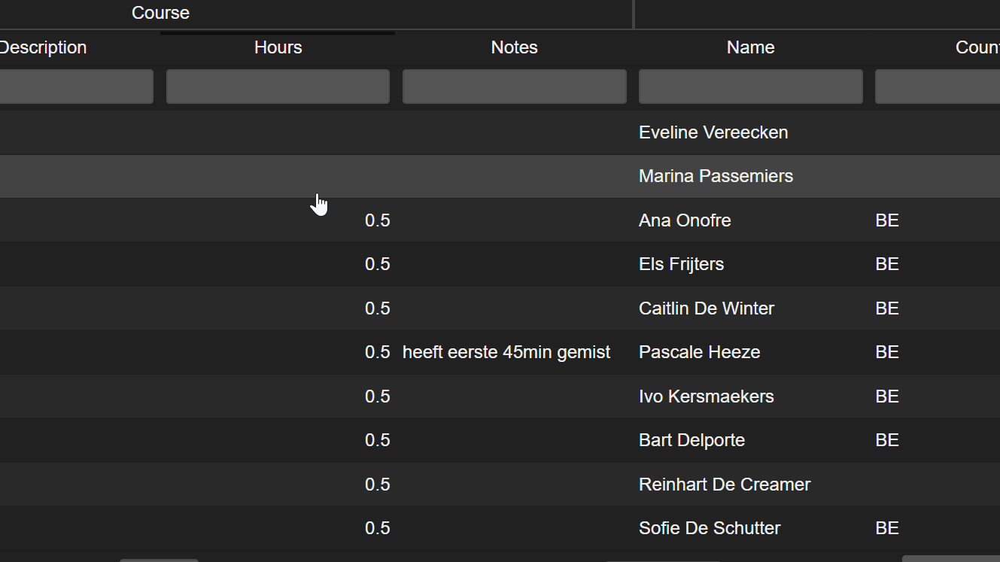

## Index

* [Filtering Tables](#filtering-tables)
* [Training Logs](training_logs.md)

## Filtering Tables

[Index](#index)
* [Date Filtering](#date-filtering)
* [Number Filtering](#number-filtering)
* [String Filtering](#string-filtering)

**Table Filtering fields have a throtteling field. Which means that your filter will only apply when you stop typing for a second.**

### Date Filtering

`01012018..` find all dates from 01/01/2018 and onwards

`..01012018` find all dates before and until 01/01/2018

`01012018..05012018` find all dates from 01/01/2018 until 05/01/2018

### Number Filtering

`1..3` include all numbers between 1 and 3

`>3` or `3..` find all numbers bigger than or equal to 3

`<3` or `..3` find all numbers smaller than or equal to 3

### String Filtering

string filtering is always case insensitive

`ana|bo|steve` look for all occurences of 'bo' and 'ana' and 'steve'

## Training Logs
[Index](#index)

this is a

hunk o text

fold down example

* content here

