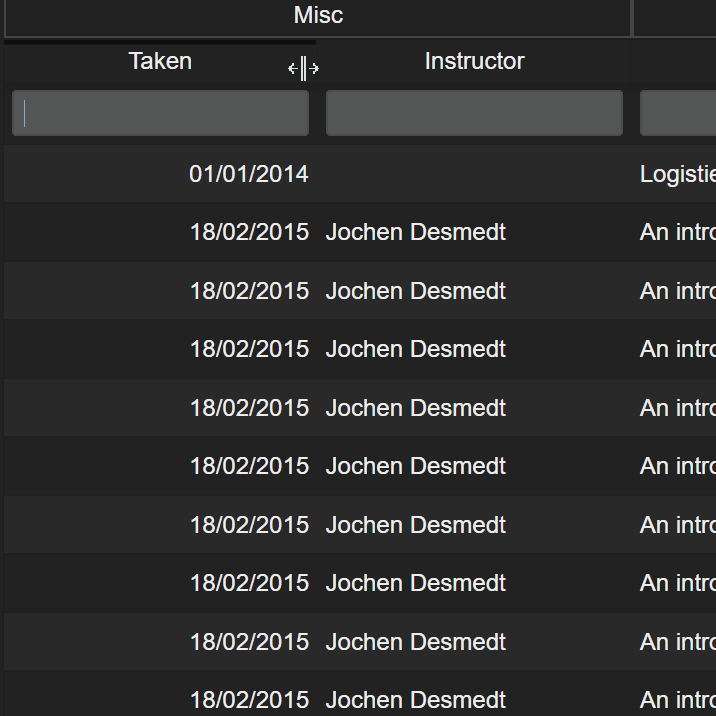

## Index

* [Filtering Tables](#filtering-tables)
* [Training Logs](#training-logs)

## Filtering Tables

[Index](#index)

### date filtering

`01012018..` find all dates from 01/01/2018 and onwards

`..01012018` find all dates before and until 01/01/2018

`01012018..05012018` find all dates from 01/01/2018 until 05/01/2018

### number filtering

`1..3` include all numbers between 1 and 3

`>3` find all numbers bigger than or equal to 3

`<3` find all numbers smaller than or equal to 3

### string filtering

string filtering is always case insensitive

`ana|bo|steve` look for all occurences of 'bo' and 'ana' and 'steve'

Training Department

* 1
* 2
* 3
* 4
* 5

* 1
* 2
* 3
* 4
* 5

* 1
* 2
* 3
* 4
* 5

* 1
* 2
* 3
* 4
* 5

* 1
* 2
* 3
* 4
* 5

* 1
* 2
* 3
* 4
* 5

* 1
* 2
* 3
* 4
* 5

* 1
* 2
* 3
* 4
* 5

* 1
* 2
* 3
* 4
* 5

* 1
* 2
* 3
* 4
* 5

* 1
* 2
* 3
* 4
* 5

* 1
* 2
* 3
* 4
* 5

## Training Logs
[Index](#index)

this is a

hunk o text

