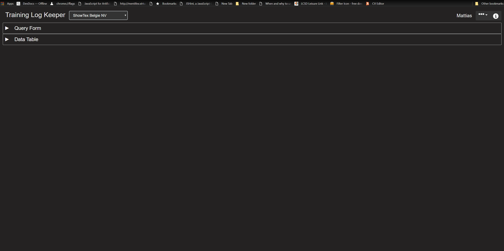
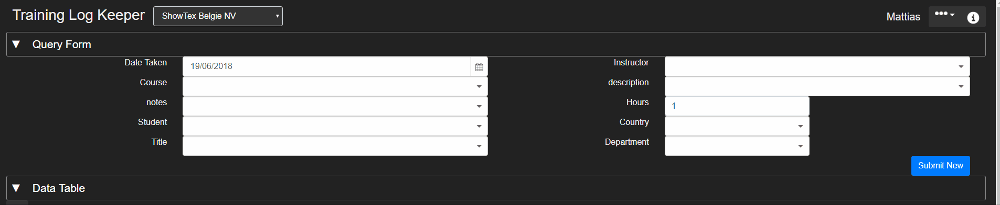
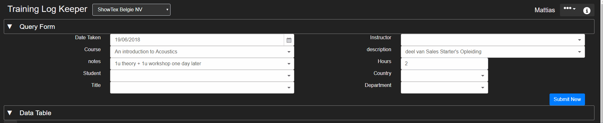
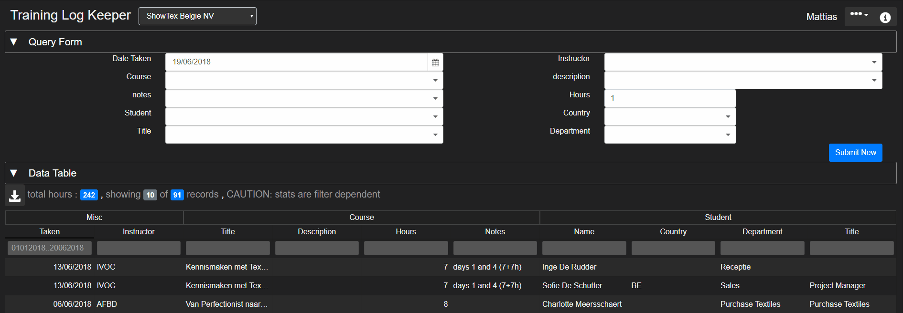
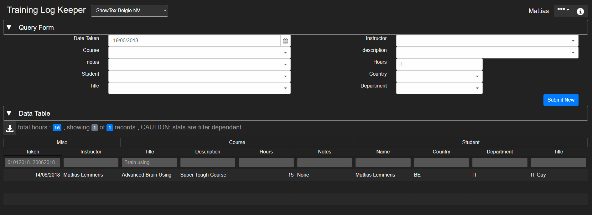
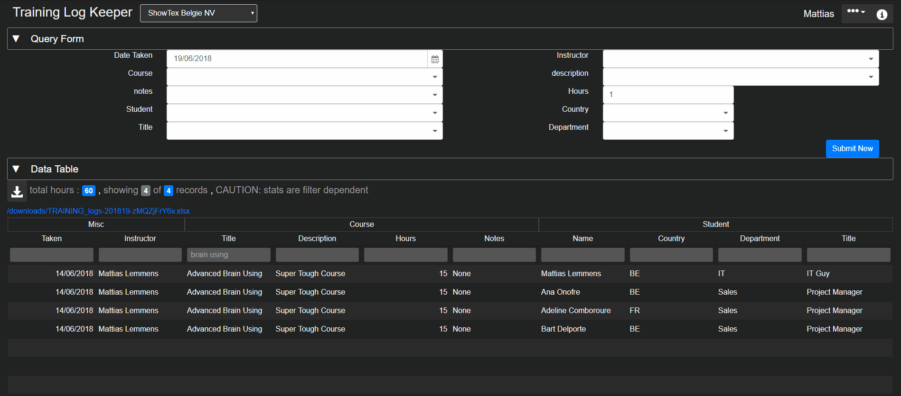
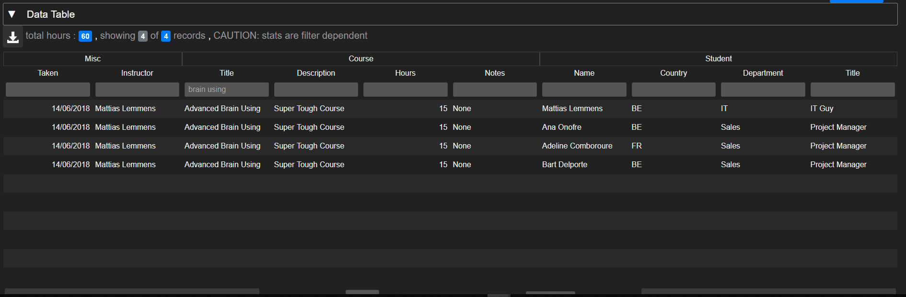
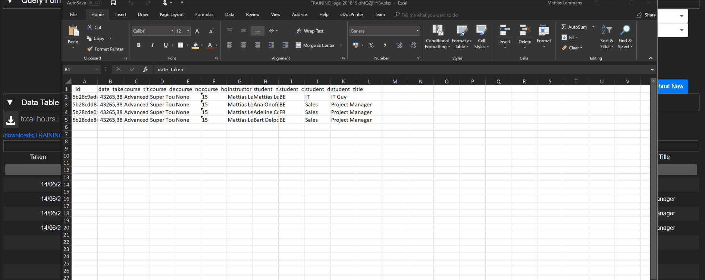
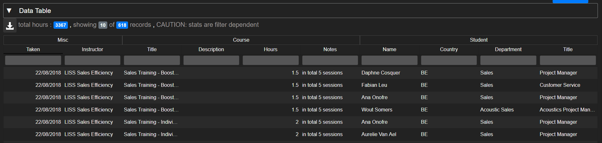

# Training Logs [Back To Main](README.md)

### Index
* [Collapsible Sections](#collapsible-sections)
* [DropDownList Input](#dropdownlist-Input)
* [Auto Complete Inputs Behaviour](#auto-complete-inputs)
* [New Log](#new-log)
* [Copy and Modify Log](#copy-and-modify-log)
* [Delete Log](#delete-log)
* [Export and Download Logs](#export-and-download-logs)
* [Log Statistics](#log-statistics)

#### This page contains instructions on how to maintain the training logs keeper website and is part of the STJS_reports server

#### Collapsible Sections

This Page has 2 sections a data input section and a data table Section, 
They can be shown and hidden by clicking the main Menu Bar as shown below.

[Back To Index](#index)

#### DropDownList Input
Aside from the "Date Taken" and the "Hours" input field all the other fields are dropdown search fields, they allow the user to search for existing values as well as create new ones if they do not already exist.
More info can be found on the [Main Help](README.md#dropdownlist-input) page.
[Back To Index](#index)

#### Auto Complete Inputs
The **Date Taken** Field is standard always set to the date of today, unless you have clicked on a data object.

The **Instructor** Field is automatically filled in when the **Course** field is modified, do not forget to fill this one in when creating a new entry. 

If the value in the "Course" input field already exists in the database than the fields Instructor, Description, Notes and Hours will be filled in according to the first record found that matches the same Course Title

If the value in the "Student" input field already esists in the database than the fields Country, Title and Department will be filled in according to the first record found that matches the same Student Name.

[Back To Index](#index)

#### New Log
The Simple Explanation is fill in the fields and click the blue "Submit New" Button. Check out the shortcut keys on [DropDownList](README.md#dropdownlist-input) for speed up your input. Also be sure to use the **TAB** and **SHIFT+TAB** to move back and forth between the input fields. Also check out the instuctions on [Modify Log](#modify-log) as it can really improve your input speed.

[Back To Index](#index)

#### Copy and Modify Log
1. Click an existing log in the data table. (notice form fields update)
2. Click the "Unlink" button in the form. (notice unlink, delete and _id tag disappear)
3. Modify desired fields.
4. Click on "Submit New"

(**TIP**: pre-filter your table so you can see the new reccords apear in your table on submit)

[Back To Index](#index)

#### Delete Log
1. Click the row in the table you wish to delete
2. Click the "Delete" button

**THERE IS NO WARNING BEYOND THIS DELETE BUTTON! 
You could resubmit the form if you didn't click any rows yet, the data should still be in the form's input fiels**

[Back To Index](#index)

#### Export and Download Logs
Note that filters will be applied when exporting data. Sorting will not. Date Columns must currently be formatted to date. 

When exporting to excel the dates will appear in excel number-date format. Select the column in excel and format it to date as shown below.

[Back To Index](#index)

#### Log Statistics
Statistics showing Total Hours and Number of Records returned will updated depending on the applied filters. Note how the blue labeled numbers just above the table adjust when the filter is applied.
training_logs_statistics

[Back To Index](#index)

